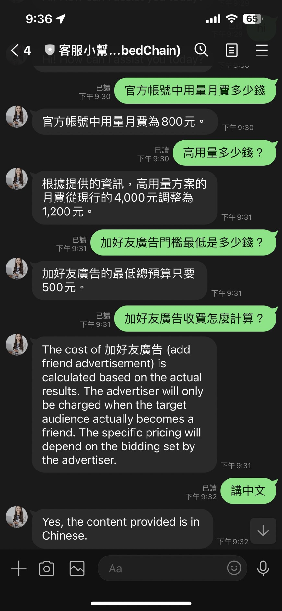

# LINEBot:  透過 EmbedChain 來建立客服小幫手（範例）

這是一個使用 FastAPI 建立的 LINE ChatBotk。此應用程式使用 embedchain 函式庫處理傳入的訊息並產生適當的回應。



## 安裝與設定

1. **安裝專案依賴**

   使用以下命令安裝專案的所有依賴：

   ```bash
   pip install -r requirements.txt
   ```

2. **設定環境變數**

   在 `.env` 檔案中設定以下環境變數：

   - `ChannelSecret`: 你的 LINE Channel Secret。
   - `ChannelAccessToken`: 你的 LINE Channel Access Token。

   如果你沒有這些訊息，你需要到 LINE Developer Portal 建立一個新的 channel 並獲取這些訊息。

## 部署在雲端服務器

### 部署在 Heroku

[](https://heroku.com/deploy)

- Input `Channel Secret` and `Channel Access Token`.
- Input [OpenAI API Key](https://platform.openai.com/account/api-keys) in `OPENAI_API_KEY`.
- Remember your heroku, ID.

### 部署在 Rener.com

[](https://render.com/deploy)

## 運行

1. **啟動 FastAPI 應用程式**

   使用以下命令啟動應用程式：

   ```bash
   uvicorn main:app --reload
   ```

2. **設定 webhook URL**

   在你的 LINE channel 中設定 webhook URL，使其指向你的 FastAPI 應用程式。你可以在本地運行這個應用程式，但請記住，你可能需要一個公開的 URL（比如通過 ngrok 創建）才能讓 LINE Messenger 成功發送請求。

## 功能

- 當 LINE 使用者傳送訊息給你的 LINE bot，這個應用程式會接收這些訊息，使用 embedchain 處理這些訊息，並向使用者傳送相應的回覆。

```

這個 README 文件應該能在 Github 上展示得很好，並提供所有必要的信息，關於如何安裝、設定和運行你的專案。
